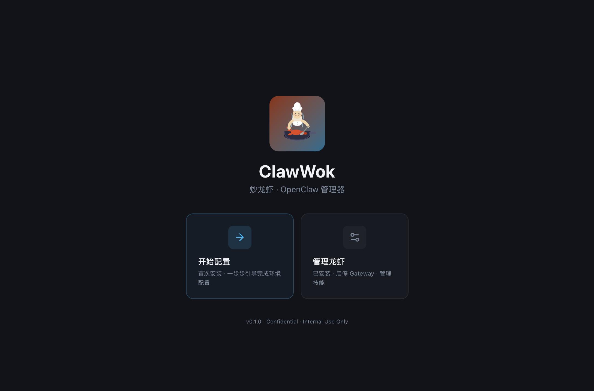
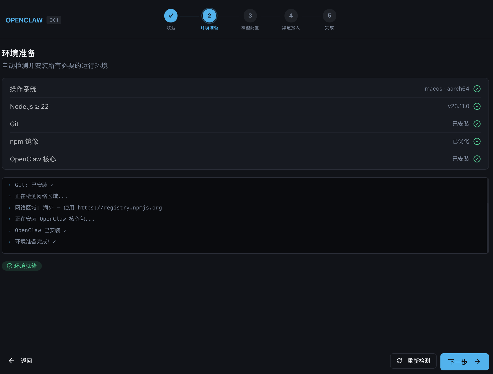
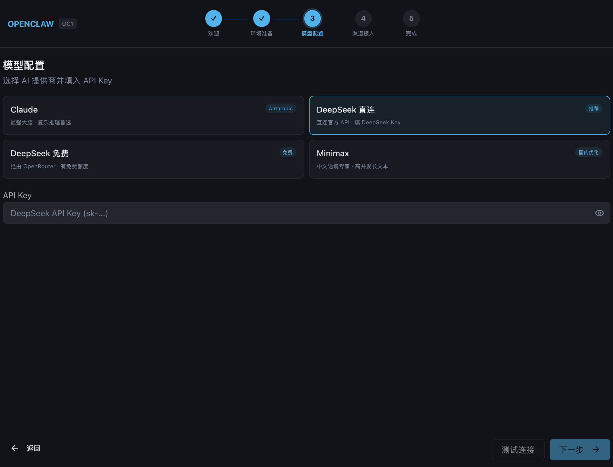
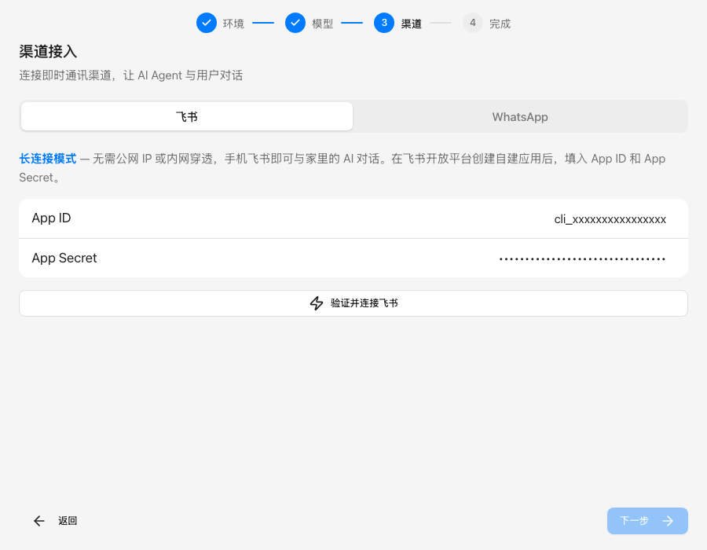
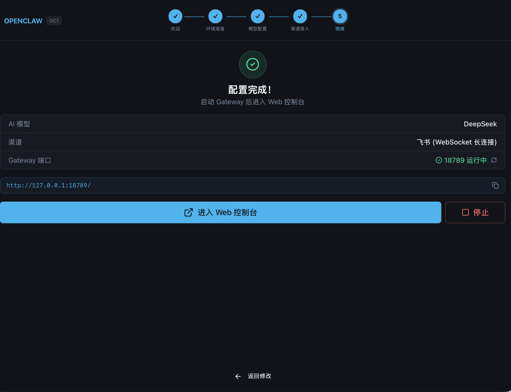
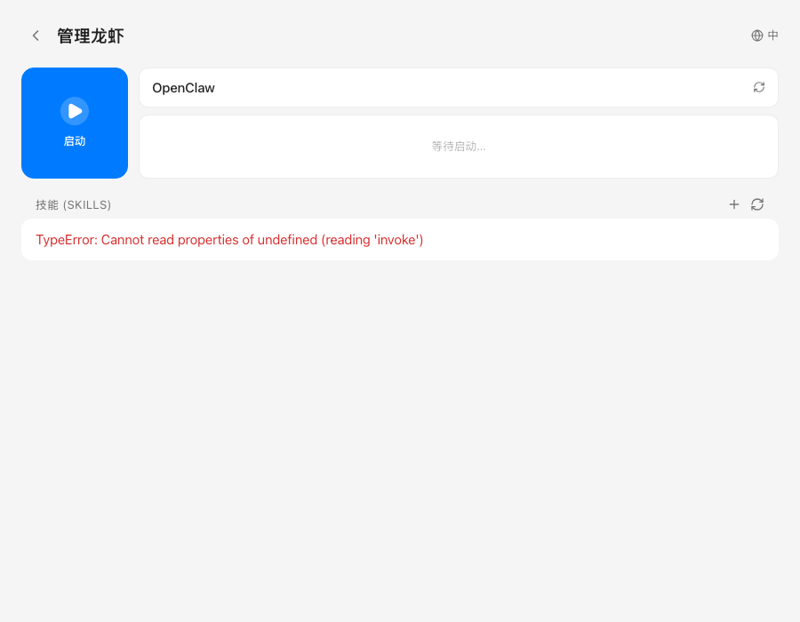

<div align="center">



# ClawWok 炒龙虾

**OpenClaw GUI Installer & Manager for macOS**

[English](#english) · [中文](#中文)

[](https://github.com/mailbobg/ClawWok/releases)
[](#)
[](https://tauri.app)

</div>

---

## English

ClawWok is a macOS desktop app that installs, configures, and manages [OpenClaw](https://openclaw.ai) — a self-hosted AI agent gateway — without touching the terminal. Connect AI models (Claude, DeepSeek, Minimax) to messaging channels (Feishu / WhatsApp / QQ) in under 5 minutes.

### Features

- **Zero-terminal setup** — guided 4-step wizard
- **Auto environment detection** — installs Node.js, npm, OpenClaw automatically
- **AI model selection** — Claude, DeepSeek (direct & free via OpenRouter), Minimax
- **Feishu WebSocket** — long-connection bot, no public IP or webhook URL needed
- **WhatsApp QR login** — scan once, works everywhere
- **QQ Bot** — webhook-based QQ bot via QQ Open Platform
- **Gateway manager** — start / stop OpenClaw Gateway with a single click
- **Skills management** — install, create, and manage OpenClaw skills
- **Bilingual UI** — Chinese / English, auto-detects system language
- **Universal Binary** — runs natively on Apple Silicon and Intel Macs

### Download

Download the latest `.dmg` from [Releases](https://github.com/mailbobg/ClawWok/releases).

### Screenshots

| Step | Preview |
|------|---------|
| Home |  |
| Environment Setup |  |
| AI Model Config |  |
| Channel (Feishu) |  |
| Complete & Gateway |  |
| Manage — Gateway & Skills |  |

---

### Feishu (Lark) Setup

ClawWok uses **WebSocket long connection** — the bot dials out to Feishu's servers.
**No public IP, no port forwarding, no reverse proxy needed.**

#### Step 1 — Create a Feishu app

1. Open [Feishu Open Platform](https://open.feishu.cn/app) and click **Create App → Custom App**
2. Fill in the name and description; upload an icon if you like
3. Under **Credentials & Basic Info**, copy your **App ID** and **App Secret**

#### Step 2 — Enable required permissions

Go to **Permissions & Scopes** and add the following, then publish a version to activate them:

| Permission | Purpose |
|---|---|
| `im:message` | Read incoming messages |
| `im:message:send_as_bot` | Send replies as the bot |
| `im:chat` | Access chat metadata |
| `contact:contact.base:readonly` | Read sender's profile |

#### Step 3 — Subscribe to message events

1. Go to **Event Subscriptions**
2. Set **Connection Mode** to **Long Connection** — *not* webhook
3. Add the event `im.message.receive_v1`

#### Step 4 — Enable the bot and allow single-chat

1. Go to **Features → Bot** and enable the bot
2. Enable **Allow users to send direct messages to the bot**

#### Step 5 — Paste credentials into ClawWok

Enter your **App ID** and **App Secret** in ClawWok's Channel step and click **Connect Feishu**.

ClawWok automatically:
- Verifies the credentials against the Feishu API
- Writes the config via `openclaw config set`
- Sets `dmPolicy=open` so any user can DM the bot
- Runs `openclaw doctor --fix` to add `allowFrom: ["*"]`

#### Finding your bot in Feishu

In the Feishu mobile app, search for your bot name — it appears under the **Apps** category. Tap it to open a direct-message conversation.

---

### WhatsApp Setup

ClawWok uses a WhatsApp Web-compatible library. **No business account or Meta approval needed** — it works with any regular WhatsApp number.

#### Step 1 — Select WhatsApp in ClawWok

Switch to the **WhatsApp** tab in the Channel step and click **Start WhatsApp Login**.

#### Step 2 — Scan the QR code

An ASCII QR code appears directly in the app window. On your phone:

| Platform | Path |
|---|---|
| Android | ⋮ menu → Linked Devices → Link a Device |
| iPhone | Settings → Linked Devices → Link a Device |

Point your camera at the QR code shown in ClawWok.

#### Step 3 — Wait for confirmation

After a successful scan the app shows a success message. The gateway is now connected.

> **Note:** Your phone must remain online with WhatsApp active — same requirement as WhatsApp Web.

---

### QQ Bot Setup

QQ Bot uses **webhook callback** — QQ servers push messages to a public URL. We provide a free relay service you deploy to your own Vercel account (your messages never pass through anyone else's servers).

#### Step 0 — Deploy the QQ Relay

[](https://vercel.com/new/clone?repository-url=https%3A%2F%2Fgithub.com%2Fmailbobg%2FClawWok&env=QQ_BOT_SECRET,RELAY_TOKEN&envDescription=QQ_BOT_SECRET%3A%20your%20QQ%20bot%20AppSecret%20%7C%20RELAY_TOKEN%3A%20any%20random%20string%20(shared%20with%20ClawWok)&project-name=openclaw-qq-relay)

Click the button above to deploy the QQ relay functions to your own Vercel. After deploy, add **Vercel KV** storage to the project (free plan works).

#### Step 1 — Register on QQ Open Platform

1. Go to [QQ Open Platform](https://q.qq.com/#/) and register an account
2. Complete identity verification (individual or enterprise)
3. Pass the review and face recognition to activate your account

#### Step 2 — Create a QQ Bot

1. Log in to [QQ Open Platform](https://q.qq.com/#/) and select **Bot** as the resource type
2. Fill in the bot name, avatar, and description
3. Submit and wait for approval (avoid special characters in the name)

#### Step 3 — Get AppID and AppSecret

1. Click your approved bot to enter the management console
2. Go to **Development Management** and copy the **AppID**
3. Click **Generate** next to **AppSecret** to create and copy the secret

> **Note:** Each time you regenerate AppSecret, the previous one is invalidated.

#### Step 4 — Enter credentials in ClawWok

Paste the **AppID**, **AppSecret**, your **Relay URL**, and **Relay Token** into ClawWok's QQ channel config.

#### Step 5 — Configure Webhook on QQ Open Platform

1. Go to [QQ Bot Console](https://q.qq.com/#/apps?tab=1) and click your bot
2. Navigate to [Webhook Settings](https://q.qq.com/qqbot/#/developer/webhook-setting)
3. Paste your Relay URL + `/api/qq` (e.g. `your-relay.vercel.app/api/qq`)

> **Important:** The QQ platform URL field does **not** include the `https://` prefix — remove it before pasting.

4. Confirm the webhook configuration
5. Under callback settings, enable all **direct message permissions**

#### Step 6 — Start chatting

1. In the bot console, go to **Sandbox Config** and scan the QR code to add the bot
2. Open QQ and start a conversation with your bot

---

### Build from Source

```bash
# Prerequisites: Rust toolchain, Node.js ≥ 18, Xcode Command Line Tools
git clone https://github.com/mailbobg/ClawWok.git
cd ClawWok

npm install

# Dev mode (hot-reload)
export PATH="$HOME/.cargo/bin:$PATH"
npm run tauri dev

# Production build — Universal Binary (Apple Silicon + Intel)
npm run tauri build -- --target universal-apple-darwin
# Output: src-tauri/target/universal-apple-darwin/release/bundle/dmg/
```

---

## 中文

ClawWok 是一款 macOS 桌面应用，无需打开终端，即可完成 [OpenClaw](https://openclaw.ai) 的安装、配置与管理。5 分钟内将 AI 模型（Claude、DeepSeek、Minimax）接入即时通讯渠道（飞书 / WhatsApp / QQ）。

### 功能亮点

- **零终端操作** — 4 步向导引导完成全部配置
- **自动环境检测** — 自动安装 Node.js、npm、OpenClaw 核心
- **多 AI 模型** — Claude、DeepSeek 直连 / 免费版（OpenRouter）、Minimax
- **飞书 WebSocket 长连接** — 无需公网 IP，无需内网穿透，无需回调地址
- **WhatsApp 扫码登录** — 手机扫一次即可收发消息
- **QQ 机器人** — 通过 QQ 开放平台 Webhook 接入 QQ 机器人
- **Gateway 管理** — 一键启动 / 停止 OpenClaw Gateway
- **技能管理** — 安装、创建、管理 OpenClaw 技能
- **中英双语** — 自动检测系统语言，支持手动切换
- **Universal Binary** — Apple Silicon 和 Intel 芯片 Mac 均可原生运行

### 下载

从 [Releases](https://github.com/mailbobg/ClawWok/releases) 下载最新 `.dmg` 安装包。

### 界面截图

| 步骤 | 截图 |
|------|------|
| 首页 |  |
| 环境准备 |  |
| 模型配置 |  |
| 渠道接入（飞书） |  |
| 配置完成 & Gateway |  |
| 管理页 — Gateway & 技能 |  |

---

### 飞书配置详细步骤

ClawWok 使用**长连接（WebSocket）**模式——机器人主动连接飞书服务器。
**无需公网 IP、无需内网穿透、无需配置回调地址。**

#### 第一步 — 创建飞书应用

1. 打开 [飞书开放平台](https://open.feishu.cn/app)，点击 **创建应用 → 企业自建应用**
2. 填写应用名称和描述（可上传图标）
3. 在 **凭证与基础信息** 页面，复制 **App ID** 和 **App Secret**

#### 第二步 — 开通权限

进入 **权限管理**，搜索并添加以下权限，完成后发布版本令权限生效：

| 权限标识 | 用途 |
|---|---|
| `im:message` | 读取收到的消息 |
| `im:message:send_as_bot` | 以机器人身份发送回复 |
| `im:chat` | 获取会话基础信息 |
| `contact:contact.base:readonly` | 读取发消息用户的基础信息 |

#### 第三步 — 订阅消息事件

1. 进入 **事件与回调 → 事件配置**
2. 将接收事件方式选择为 **使用长连接接收事件**（不要选 Webhook）
3. 点击 **添加事件**，搜索并添加 `im.message.receive_v1`

#### 第四步 — 开启机器人与单聊

1. 进入 **应用功能 → 机器人**，开启机器人功能
2. 找到 **允许用户向机器人发送消息**（单聊开关），将其开启

#### 第五步 — 填入 ClawWok

在 ClawWok 渠道配置步骤中，输入 App ID 和 App Secret，点击 **验证并连接飞书**。

ClawWok 自动完成以下操作：
- 调用飞书 API 验证凭据有效性
- 通过 `openclaw config set` 写入配置
- 设置 `dmPolicy=open`，允许任意用户给机器人发消息
- 执行 `openclaw doctor --fix` 自动补全 `allowFrom: ["*"]`

#### 在飞书中找到机器人

在飞书 App 搜索框搜索机器人名称，在 **应用** 分类下找到它，点击开始对话。

---

### WhatsApp 配置详细步骤

ClawWok 底层使用 WhatsApp Web 兼容库，**使用普通 WhatsApp 账号即可，无需企业账号，无需 Meta 审批**。

#### 第一步 — 选择 WhatsApp 渠道

在 ClawWok 渠道配置步骤中切换到 **WhatsApp** 标签，点击 **开始 WhatsApp 登录**。

#### 第二步 — 扫描二维码

App 界面会直接显示 ASCII 艺术二维码。在手机 WhatsApp 中操作：

| 平台 | 操作路径 |
|---|---|
| Android | 右上角三点菜单 → 已关联设备 → 关联设备 |
| iPhone | 设置 → 已关联设备 → 关联设备 |

用摄像头对准 ClawWok 界面上的二维码扫描。

#### 第三步 — 确认连接

扫码成功后 App 显示连接成功提示，Gateway 即可收发消息。

> **注意：** 手机 WhatsApp 需保持正常在线状态（与 WhatsApp Web 机制相同）。

---

### QQ 机器人配置详细步骤

QQ 机器人使用 **Webhook 回调**，需要一个公网地址。我们提供一个免费中转服务，部署到你自己的 Vercel 账号（消息不经过任何第三方）。

#### 第零步 — 部署 QQ 中转服务

[](https://vercel.com/new/clone?repository-url=https%3A%2F%2Fgithub.com%2Fmailbobg%2FClawWok&env=QQ_BOT_SECRET,RELAY_TOKEN&envDescription=QQ_BOT_SECRET%3A%20your%20QQ%20bot%20AppSecret%20%7C%20RELAY_TOKEN%3A%20any%20random%20string%20(shared%20with%20ClawWok)&project-name=openclaw-qq-relay)

点击上方按钮，将 QQ 中转函数部署到你的 Vercel。部署后在项目中添加 **Vercel KV** 存储（免费计划即可）。

#### 第一步 — 注册 QQ 开放平台账号

1. 打开 [QQ 开放平台](https://q.qq.com/#/)，注册账号
2. 完成实名认证（支持企业、个体户、个人）
3. 通过审核及人脸识别后即可入驻

#### 第二步 — 创建 QQ 机器人

1. 登录 [QQ 开放平台](https://q.qq.com/#/)，选择 **机器人** 类型创建资源
2. 填写机器人名称、头像及描述
3. 提交并等待审核通过

> **注意：** 名称不要使用特殊符号，否则可能审核不通过。

#### 第三步 — 获取 AppID 和 AppSecret

1. 点击审核通过的机器人，进入管理后台
2. 点击 **开发管理**，复制 **AppID**
3. 在 **AppSecret** 处点击 **生成** 进行重置并复制

> **注意：** 每次重新生成 AppSecret 后，旧的 Secret 将失效。

#### 第四步 — 在 ClawWok 中填写凭据

在 ClawWok QQ 渠道配置中填入 **AppID**、**AppSecret**、**Relay URL** 和 **Relay Token**。

#### 第五步 — 在 QQ 开放平台配置回调地址

1. 进入 [QQ 机器人后台](https://q.qq.com/#/apps?tab=1)，点击需要配置的机器人
2. 进入 [Webhook 设置](https://q.qq.com/qqbot/#/developer/webhook-setting)
3. 填入你的 Relay 地址 + `/api/qq`（如 `your-relay.vercel.app/api/qq`）

> **注意：** QQ 平台的地址栏不包含 `https://`，粘贴时需要去掉协议前缀。

4. 确认配置 Webhook 回调地址
5. 在回调配置栏添加所有 **单聊权限**

#### 第六步 — 开始使用

1. 在机器人后台进入 **沙箱配置**，扫描二维码添加机器人
2. 打开 QQ，与机器人开始对话

---

### 从源码构建

```bash
# 前置依赖：Rust、Node.js ≥ 18、Xcode Command Line Tools
git clone https://github.com/mailbobg/ClawWok.git
cd ClawWok

npm install

# 开发模式（热更新）
export PATH="$HOME/.cargo/bin:$PATH"
npm run tauri dev

# 正式打包（Universal Binary，同时支持 Intel 和 Apple Silicon）
npm run tauri build -- --target universal-apple-darwin
# 产物：src-tauri/target/universal-apple-darwin/release/bundle/dmg/
```

---

<div align="center">
<sub>Built with Tauri 2 · React 18 · Rust · macOS only · v0.1.0</sub>
</div>
